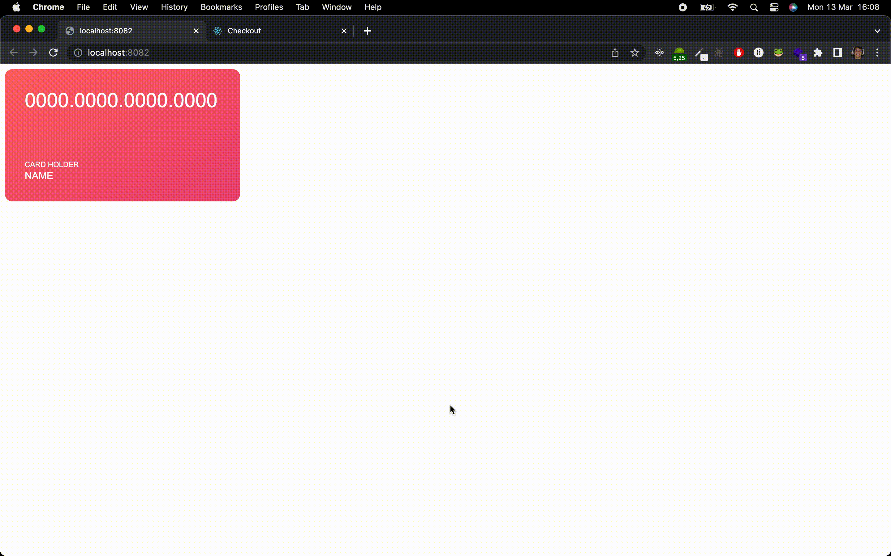

# Micro front-end concept

## Running



## Concept

In this application I tried to apply some micro-front-end concepts. The credit card was created in Vue and the payment method in React. I ask you not to look at the quality of the Vue application, as it is not something I am used to working with, I studied little to create this. 😅

## Commands

To execute Vue app (credit card lib)

```shell
yarn start:lib-credit-card
```

To execute React App (checkout page)

```shell
yarn start:mfe-checkout
```

### Next steps

- [ ] Create unit tests
- [ ] Create end to end tests
- [ ] Integrate with an API
